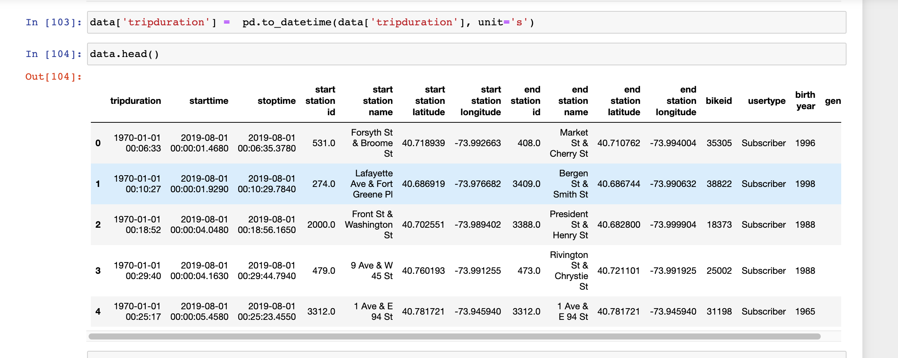

# bikesharing

# Overview of the project
### Our job is to convince investors that a bike-sharing program in Des Moines is a solid business proposal! We will be using Tableau Public tp help us decide if having a bike-sharing program will be as successful as the bike-sharing programs in New York City. What is the population of Des Moines? How does its population compare to the population of New York City? Does the population affect the number of people who will use the bike-sharing program?

# Results
[link to dashboard](https://public.tableau.com/profile/ednuel#!/vizhome/Challenge_16136397108280/Story2?publish=yes)

Deliverable 1: Change Trip Duration to a Datetime Format

Deliverable 2: Create Visualizations for the Trip Analysis

Deliverable 3: Create a Story and Report for the Final Presentation

# Summary
### With the population of Des Moines being significantly lower than the population of New York City 

# Resources
https://www.census.gov/quickfacts/fact/table/desmoinescityiowa/PST045219
https://www.census.gov/quickfacts/fact/table/newyorkcitynewyork/PST045219
